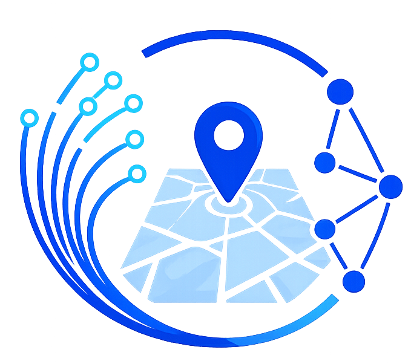
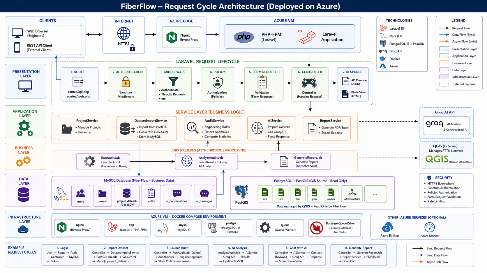
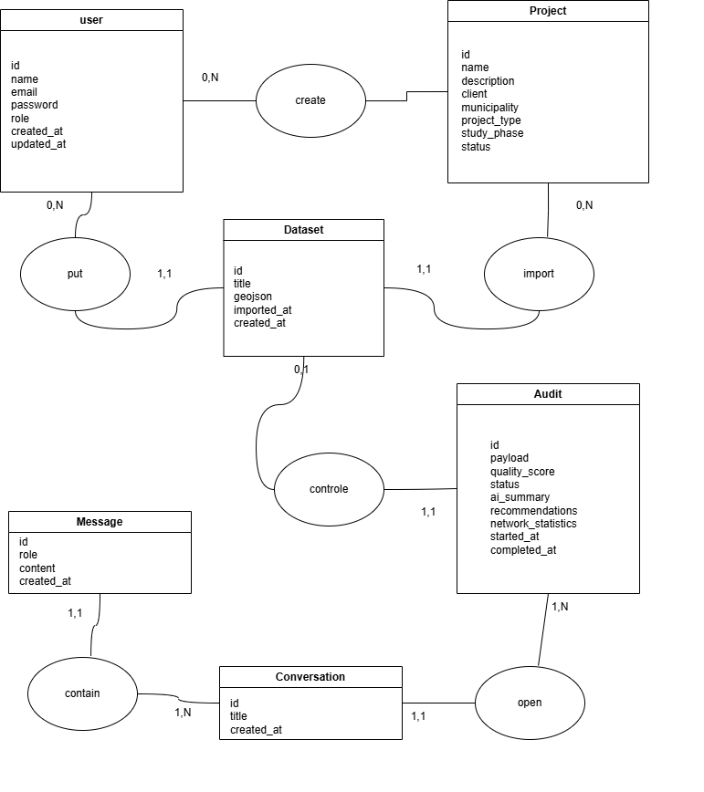
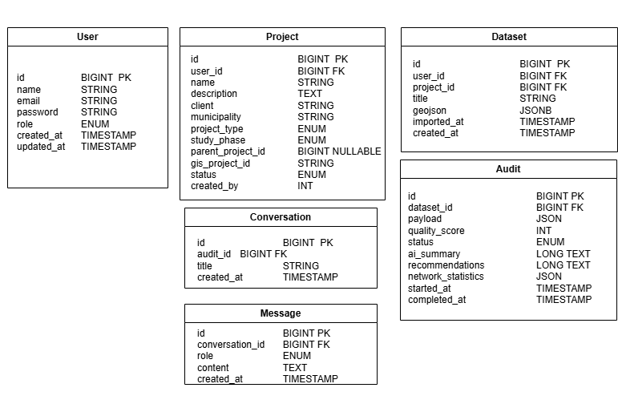

<p align="center">
  
</p>

<h1 align="center">FiberFlow</h1>

<p align="center">
  <strong>Smarter FTTH Audits. Powered by AI.</strong>
</p>

<p align="center">
  
  
  
  
  
</p>

<p align="center">
  
  
  
  
  
  
</p>

<p align="center">
  <a href="#-quick-start">Quick Start</a> &bull;
  <a href="#-architecture">Architecture</a> &bull;
  <a href="#-api-documentation">API Docs</a> &bull;
  <a href="#-docker-setup">Docker</a> &bull;
  <a href="#-testing">Testing</a> &bull;
  <a href="#-project-structure">Structure</a>
</p>

---

## About

**FiberFlow** is an API-first platform designed to supervise, audit, and analyze FTTH (Fiber To The Home) engineering studies. Built for telecommunications design offices, it automates the technical audit process that is traditionally manual, slow, and error-prone.

The application reads network data produced by QGIS and stored in PostgreSQL/PostGIS, performs automated quality scoring with weighted breakdowns (connectivity, coherence, capacity, extensibility), detects anomalies with phase-aware severity, and provides AI-powered interpretation through contextual chat — all without modifying the source GIS data.

### Key Features

| Feature | Description |
|---------|-------------|
| **Project Management** | Transport/Distribution project types, parent hierarchy, study phase lifecycle (APS → APD → PRO → EXE → REC → FIN) |
| **GIS Integration** | PostGIS data import, GeoJSON conversion, Leaflet map visualization, network element search & filtering |
| **Technical Audits** | Weighted quality scoring (0-100), engineering rule validation per project type, phase-aware anomaly severity |
| **AI Assistant** | Groq-powered audit interpretation, structured JSON output, contextual chat for engineers |
| **PDF & Excel Reports** | Executive summary PDFs, 7-sheet Excel exports with full audit data |
| **REST API** | 27 documented endpoints with Bearer token auth, OpenAPI 3.0 spec, Postman collection |

---

## Architecture

FiberFlow uses a dual-database architecture: **MySQL** for the application layer and **PostgreSQL/PostGIS** for spatial network data. An async queue worker processes audit jobs in the background.

<p align="center">
  
</p>

---

## Tech Stack

<table>
  <tr>
    <td><strong>Layer</strong></td>
    <td><strong>Technology</strong></td>
  </tr>
  <tr>
    <td>Backend</td>
    <td>Laravel 13, PHP 8.3, Eloquent ORM</td>
  </tr>
  <tr>
    <td>Frontend</td>
    <td>Blade, Alpine.js 3, Tailwind CSS 3, Leaflet 1.9, Chart.js 4, Cytoscape 3</td>
  </tr>
  <tr>
    <td>Application Database</td>
    <td>MySQL 8.0</td>
  </tr>
  <tr>
    <td>Spatial Database</td>
    <td>PostgreSQL 16 + PostGIS 3.4</td>
  </tr>
  <tr>
    <td>AI Provider</td>
    <td>Laravel AI SDK + Groq (meta-llama/llama-4-scout)</td>
  </tr>
  <tr>
    <td>Authentication</td>
    <td>Laravel Sanctum (Bearer Tokens)</td>
  </tr>
  <tr>
    <td>Queue</td>
    <td>Laravel Queue (database driver)</td>
  </tr>
  <tr>
    <td>Build</td>
    <td>Vite 8, PostCSS, Autoprefixer</td>
  </tr>
  <tr>
    <td>Testing</td>
    <td>Pest 4, PHPUnit 12</td>
  </tr>
  <tr>
    <td>Code Quality</td>
    <td>Laravel Pint</td>
  </tr>
  <tr>
    <td>API Docs</td>
    <td>Laravel Scribe (HTML, Postman, OpenAPI 3.0)</td>
  </tr>
  <tr>
    <td>Reports</td>
    <td>Barryvdh/DomPDF 3, Maatwebsite/Excel 3</td>
  </tr>
</table>

---

## Quick Start

### Prerequisites

- **PHP 8.3** or higher
- **Composer** 2.x
- **Node.js** 18+ & npm
- **MySQL 8.0**
- **PostgreSQL 16** with PostGIS 3.4
- **Docker** (optional, for containerized setup)

### Installation

```bash
# Clone the repository
git clone https://github.com/BEN-ESSAHRAOUI-Yassine/fiberflow.git
cd fiberflow

# Install PHP dependencies
composer install

# Create environment file
cp .env.example .env

# Generate application key
php artisan key:generate

# Configure your .env (see Environment Variables below)

# Run database migrations
php artisan migrate --force

# Seed the database (optional)
php artisan db:seed

# Install Node.js dependencies
npm install

# Build frontend assets
npm run build
```

### Environment Variables

Add these to your `.env` file:

```env
# Application
APP_NAME=FiberFlow
APP_ENV=local
APP_DEBUG=true
APP_URL=http://localhost:8000

# MySQL (Application Database)
DB_CONNECTION=mysql
DB_HOST=127.0.0.1
DB_PORT=3306
DB_DATABASE=fiberflow
DB_USERNAME=root
DB_PASSWORD=

# Groq AI
GROQ_API_KEY=your_groq_api_key_here
GROQ_MODEL=meta-llama/llama-4-scout-17b-16e-instruct

# Queue
QUEUE_CONNECTION=database

# Session
SESSION_DRIVER=database
```

### Start the Server

```bash
php artisan serve
```

Visit **http://localhost:8000** in your browser.

---

## Docker Setup

FiberFlow includes a production Docker Compose stack with MySQL, PHP-FPM (running the app and the queue worker via Supervisord), and Nginx.

```bash
# Start all services
docker compose up -d

# Run migrations inside the app container
docker compose exec app php artisan migrate --force

# Seed demo data
docker compose exec app php artisan db:seed
```

### Services

| Service | Container | Port | Description |
|---------|-----------|------|-------------|
| **Nginx** | `fiberflow-nginx` | `80` | Web server |
| **PHP-FPM** | `fiberflow-app` | — | Application runtime + queue worker (Supervisord) |
| **MySQL** | `fiberflow-mysql` | `3306` | Application database |

---

## API Documentation

FiberFlow exposes a REST API with **27 endpoints** across **7 groups**, documented with [Laravel Scribe](https://scribe.knuckles.wtf).

| Endpoint | Method | Description |
|----------|--------|-------------|
| `/docs` | GET | Interactive HTML documentation |
| `/docs.postman` | GET | Postman collection export |
| `/docs.openapi` | GET | OpenAPI 3.0.3 spec |

### Authentication

All endpoints (except `register` and `login`) require a Bearer token:

```bash
# Login to get a token
curl -X POST http://localhost:8000/api/v1/login \
  -H "Content-Type: application/json" \
  -d '{"email": "admin@example.com", "password": "password"}'

# Use the token in subsequent requests
curl http://localhost:8000/api/v1/projects \
  -H "Authorization: Bearer YOUR_TOKEN"
```

### API Groups

| Group | Endpoints | Description |
|-------|-----------|-------------|
| **Authentication** | 7 | Register, login, logout, profile, password |
| **Dashboard** | 1 | Aggregated statistics |
| **Projects** | 6 | CRUD + restore |
| **Datasets** | 4 | Import, list, show, delete |
| **Network** | 1 | GeoJSON features with search/filter |
| **Audits** | 3 | Launch, list, show |
| **Users** | 5 | Admin CRUD |

---

## Project Structure

```
fiberflow/
├── app/
│   ├── Ai/                    # AI provider integrations
│   ├── Data/                  # Data transfer objects
│   ├── Enums/                 # ProjectType, StudyPhase, AuditStatus, UserRole, etc.
│   ├── Events/                # AuditCompleted event
│   ├── Exports/               # Maatwebsite Excel exports
│   ├── Http/
│   │   ├── Controllers/       # Web + API controllers
│   │   ├── Middleware/         # AdminMiddleware
│   │   ├── Requests/          # Form Request validation
│   │   └── Resources/         # API Resources (JSON formatting)
│   ├── Jobs/                  # RunAuditJob, AnalyzeAuditJob
│   ├── Models/                # Eloquent models
│   ├── Policies/              # Authorization policies
│   ├── Services/              # AuditService, GISService, AIService, etc.
│   └── View/                  # View components
├── config/                    # Laravel config files
├── database/
│   ├── factories/             # Model factories for testing
│   └── seeders/               # Database seeders
├── docs/                      # Project documentation + diagrams
│   ├── Diagrams/              # Architecture, MCD, MLD diagrams
│   └── *.md                   # Specification, business rules, etc.
├── .dockerignore             # Docker build exclusions
├── Dockerfile                # PHP-FPM app image (multi-stage, prod)
├── Dockerfile.nginx          # Nginx image (prod)
├── docker-compose.yml        # Production stack (app + nginx + mysql)
├── public/                   # Public assets
├── resources/
│   └── views/                 # Blade templates (37 views + 14 components)
├── routes/
│   ├── api.php                # API routes (v1)
│   └── web.php                # Web routes (Blade demo)
├── storage/
│   └── app/private/scribe/    # Generated API docs (Postman, OpenAPI)
└── tests/                     # Pest 4 test suite
```

---

## Data Model

### Conceptual Data Model (MCD)

<p align="center">
  
</p>

### Logical Data Model (MLD)

<p align="center">
  
</p>

### Application Tables

| Table | Description |
|-------|-------------|
| `users` | User accounts with roles (admin, ingenieur) |
| `projects` | FTTH projects with type, phase, status, hierarchy |
| `project_datasets` | Imported GeoJSON datasets |
| `audits` | Audit records with scores, anomalies, AI summary |
| `ai_conversations` | AI chat sessions per audit |
| `ai_messages` | Individual messages in AI conversations |

### GraceTHD Spatial Tables

| Table | Description |
|-------|-------------|
| `t_noeud` | Network nodes (points of presence) |
| `t_cheminement` | Routing paths (line geometries) |
| `t_cable` | Fiber cables |
| `t_fibre` | Individual fiber strands |
| `t_ebp` | External connection points |
| `t_ltech` | Technical enclosures |
| `t_cassette` | Fiber cassettes |
| `t_znro` | Distribution zones |
| `t_zpbo` | Building connection zones |
| `t_ptech` | Technical points |
| `t_conduite` | Conduits |

---

## Testing

FiberFlow uses **Pest 4** for testing with 151+ tests across feature and unit suites.

```bash
# Run all tests
php artisan test

# Run with compact output
php artisan test --compact

# Run specific test suite
php artisan test --filter=AuditTest

# Run with verbose output
php artisan test --verbose
```

### Test Coverage

| Area | Tests |
|------|-------|
| Authentication | Login, register, logout, token management |
| Projects | CRUD, authorization, hierarchy validation |
| Audits | Launch, scoring, anomaly detection |
| AI Integration | Chat, structured output, error handling |
| GIS Service | PostGIS import, GeoJSON conversion |
| Dashboard | Statistics aggregation |
| Users | Admin CRUD, role enforcement |
| PDF/Excel | Report generation, export |

---

## Development

```bash
# Start all dev services concurrently (server + queue + vite)
composer dev

# Or run individually:
php artisan serve                    # Server
php artisan queue:listen --tries=1   # Queue worker
npm run dev                          # Vite dev server
```

### Code Quality

```bash
# Format code with Pint
vendor/bin/pint

# Run Pint on changed files only
vendor/bin/pint --dirty
```

---

## Documentation

| Document | Description |
|----------|-------------|
| [Project Specification](docs/PROJECT_SPECIFICATION.md) | Full project spec with requirements |
| [Business Rules](docs/BUSINESS_RULES.md) | Engineering validation rules |
| [API Endpoints](docs/API_ENDPOINTS.md) | REST API reference |
| [AI Specification](docs/AI_SPECIFICATION.md) | AI integration details |
| [Database Dictionary](docs/DATABASE_DICTIONARY.md) | Table/column reference |
| [Deployment Guide](docs/DEPLOYMENT.md) | Deployment instructions |
| [Testing Strategy](docs/TESTING_STRATEGY.md) | Test approach & coverage |
| [Code Ruleset](docs/RULESET.md) | Coding standards & conventions |

---

## License

FiberFlow is open-source software licensed under the [MIT License](LICENSE).

---

<p align="center">
  Built with <strong>Laravel 13</strong> &bull; <strong>PostGIS</strong> &bull; <strong>AI</strong> for smarter fiber network audits.
</p>
